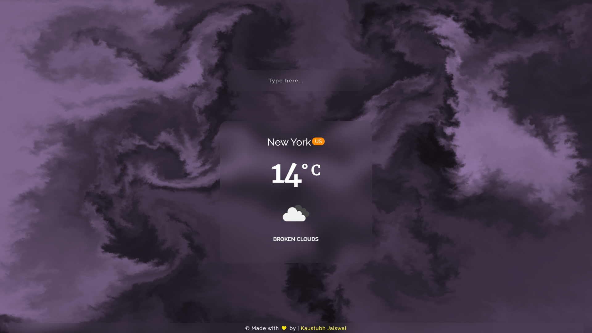

<a target="_blank" rel="noopener noreferrer" href="https://github.com/kaustubh2020/weather-pwa-app"><h1 align="center">Weather PWA App</h1></a>

 <h2 align="center">PWA made by React.js to check Weather</h2>
 
 
 

    

<!-- Footer -->
 

<!-- Footer END -->

## :wrench: Setup

`git clone https://github.com/kaustubh2020/kaustubh-portfolio`

In the project directory, you can run:

`npm install`

Install all the necessary files to start the app.

`npm run develop`

Runs the app in the development mode.

`npm run build`

Builds the app for production to the `build` folder. 
It correctly bundles React in production mode and optimizes the build for the best performance.
